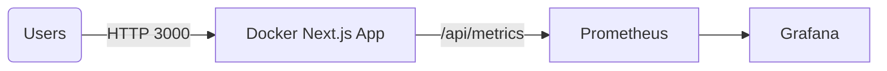

# Docker Next.js App

A minimal **Next.js** web app containerized with **Docker** using a **multi‑stage build** for a lightweight production image. Includes:

- `docker-compose.yml` for quick local runs.
- Built‑in **health checks** and **/api/metrics** endpoint (Prometheus format) for **observability**.
- **Prometheus + Grafana** stack for metrics visualization.
- Secure configuration via **`.env`** (not committed).
- **Backup/restore** scripts for Prometheus & Grafana data.
- **Kubernetes manifests** (Deployment/Service/Ingress/ServiceMonitor).
- CI/CD with **GitHub Actions** to build & publish the image.
- A basic **topology diagram** (Mermaid) in `diagrams/architecture.mmd`.

---

## Prerequisites

Ensure you have the following tools installed and configured on your system:

- `Docker`
- `Docker Compose`
- `Git`
- `Github Personal Access Token` to use the ci.yml and allow the **write:packages**, **read:packages**

---

## Quick Start

1. **Clone** this repo and create `.env` (never commit it):
   ```bash
   cp .env.example .env
   # edit .env and set GRAFANA_ADMIN_PASSWORD=...
   ```

2. **Build & run** the stack:
   ```bash
   docker compose up -d --build
   ```

3. Open the apps:
   - Next.js app: http://localhost:3000
   - Health: http://localhost:3000/api/healthz
   - Metrics: http://localhost:3000/api/metrics
   - Prometheus: http://localhost:9090
   - Grafana: http://localhost:3001 (use credentials from `.env`)

4. **Stop**:
   ```bash
   docker compose down
   ```

---

## Application Code (in `app/`)

- Minimal Next.js project in `app/` (classic `pages/` routing).
- Added **`prom-client`** and two API routes:
  - `/api/healthz` -> returns `{ "status": "ok" }` for container **health checks**.
  - `/api/metrics` -> exposes **Prometheus** metrics (process, runtime, etc.).
- `next.config.js` enables `output: 'standalone'` so the runtime image contains only what it needs.

**Reasoning**: `standalone` significantly trims the runtime image; API routes add observability and health probes with minimal code.

---

## Docker Image Design (Why these decisions?)

- **Multi-stage build**: dependencies -> build -> minimal runtime keeps the final image small and secure.
- **Alpine** base (Node 20): smaller footprint, quick startup.
- **Non‑root user (`node`)**: principle of least privilege.
- **Healthcheck** hitting `/api/healthz` for fast failure detection.
- **Port 3000 exposed** to match Next.js default and assignment requirement.
- **MTU tuning on Docker network** (default 1450) to reduce fragmentation on cloud overlays/VPNs. Adjust per infra.

---

## Observability

- **App metrics**: `prom-client` on `/api/metrics` (scraped by Prometheus).
- **Prometheus**: ships with `prometheus/prometheus.yml` scraping `app:3000`.
- **Grafana**: convenient visualizations. Set admin password via `.env`. You can import NodeJS/Process dashboards.

---

## Backups & Restore

Persisted data (Docker volumes):
- `prometheus_data` (Prometheus TSDB)
- `grafana_data` (dashboards, users, config)

Scripts:
```bash
# Backup
./scripts/backup.sh

# Restore (choose a specific archive)
./scripts/restore.sh backups/grafana_data_YYYY-MM-DD.tgz backups/prometheus_data_YYYY-MM-DD.tgz
```

Archives are stored under `./backups/` (gitignored).

---

## Security & Secrets

- **Never commit `.env`**. Use `.env.example` for placeholders.
- In CI/CD, use **GitHub Secrets** (`GHCR_TOKEN`, `GRAFANA_ADMIN_PASSWORD`, etc.).
- Runtime user is **non‑root**.
- Remove any credentials from code and configs.

For Docker Swarm/Kubernetes, prefer **Docker/K8s secrets** over env vars for sensitive values.

---

## Networking & Performance Tuning

- Custom bridge network with **MTU** setting (default **1450**). Tune to match your infra (e.g., **1500** on LAN).
- Next.js **compression** enabled (see `next.config.js`) -> reduces payload size.
- **Keep-Alive** and caching automatically handled by Next.js/Node core.
- If fronted by a gateway/ingress, terminate TLS there and pass HTTP to the app locally.

---

## CI/CD (GitHub Actions → GHCR)

Workflow: `.github/workflows/ci.yml`:
- Lints/builds the app.
- Builds and pushes the image to **GitHub Container Registry**.
- You can add a **deploy** job (SSH to a server and run `docker compose pull && up -d`).

**Secrets needed**:
- `GHCR_USERNAME`, `GHCR_TOKEN` (a PAT with `write:packages`)

**Tagging**: pushes `:sha-<shortsha>` and `:latest` on `main`.

---

## Kubernetes

Included:
- `deployment.yaml` — container image, probes (`/api/healthz`), resources, security.
- `service.yaml` — ClusterIP service.
- `ingress.yaml` — example for NGINX Ingress.
- `servicemonitor.yaml` — scrape metrics with Prometheus Operator (CNCF ecosystem).

Before applying the manifests in k8s/, follow these steps to configure private image access and enable Prometheus monitoring:

1. Create ghcr-secret (For Private Image Pull)

If your Docker image on GHCR (GitHub Container Registry) is private, create a Kubernetes secret to allow pulling:

```bash
kubectl create secret docker-registry ghcr-secret \
  --docker-server=ghcr.io \
  --docker-username=<your-github-username> \
  --docker-password=<your-personal-access-token> \
  --docker-email=your@email.com
```

> Make sure the `imagePullSecrets` section in your `deployment.yaml` references `ghcr-secret`.

2. Install Prometheus Operator (for ServiceMonitor support)

```bash
# Add the Helm repo
helm repo add prometheus-community https://prometheus-community.github.io/helm-charts
helm repo update

# Install the Prometheus Operator stack
helm install kube-prometheus prometheus-community/kube-prometheus-stack
```
3. Apply the Kubernetes Manifests

Once the prerequisites are ready, apply all manifests in the k8s/ folder:

```bash
kubectl apply -f k8s/
```

---

## Topology Diagram (Mermaid)

See `diagrams/architecture.mmd`. to preview Mermaid in many markdown tools.



---

## Implementation Notes / How‑To

- **Local**: `docker compose up -d --build`.
- **Config changes**: edit files then `docker compose up -d --build` (zero-hassle).
- **Immediate accuracy**: health checks and Prometheus scrape pick up changes on redeploy.
- **Restore**: see scripts; volumes tarred for portability.
- **Scaling**: for >1 instance, add replicas behind a reverse proxy (Traefik/NGINX) or move to Kubernetes.

---